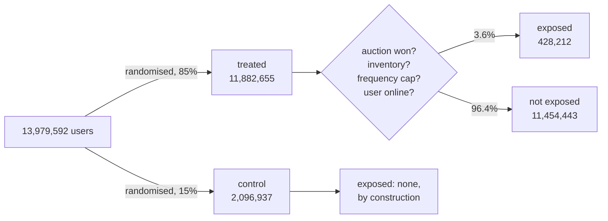
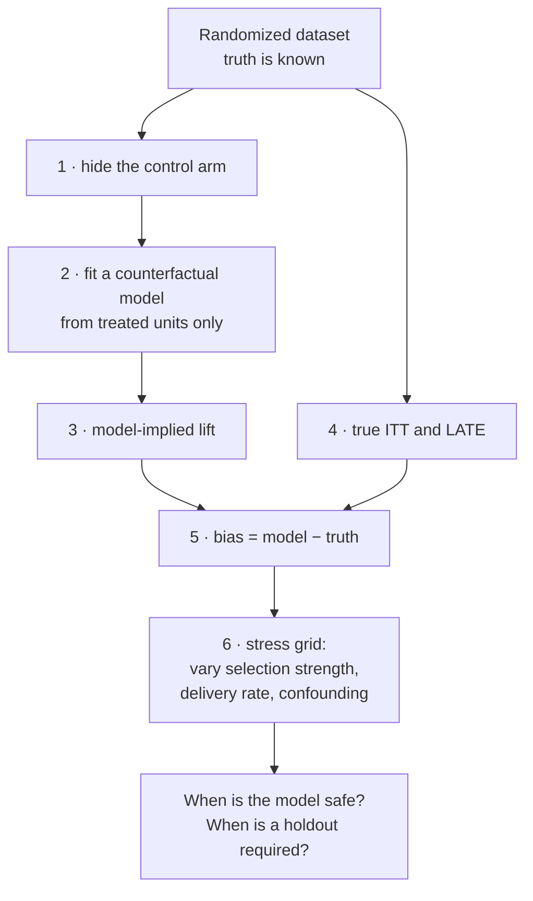

# incrementality-lab

**Does a model-based counterfactual recover the true incremental effect of advertising?**

Non-experimental methods are what most promotion products actually use to report their
impact, because a randomized holdout costs real revenue. This repository tests those methods
against a dataset where the truth is known, using a **real 14-million-user randomized
advertising experiment** as ground truth.

The decision it informs: **is a randomized holdout a necessary investment, or an avoidable
cost?**

---

## 1. The problem, in one picture

Being *assigned* to a campaign is not the same as *actually seeing an ad*. What sits between
them is an auction, and the auction does not pick users at random.



The auction selects **active** users. So comparing *the people who saw an ad* against *the
whole control group* compares heavy browsers against everyone, and attributes the difference
to advertising.

| Comparison | Conversion effect | Valid? | Why |
|---|---|---|---|
| exposed vs control | **+5.185 pp** | ✗ | Conditions on `exposure`, which is decided *after* randomisation by the auction |
| all treated vs control (**ITT**) | **+0.115 pp** (+59.4%) | ✓ | Protected by randomisation; matches the decision "should we switch the campaign on" |
| effect on those actually reached (**LATE**) | **+3.195 pp** | ✓ | `ITT / 0.036`, valid under one-sided non-compliance |

**The naive number overstates the true effect on reached users by 62%.**

## 2. What has been established so far

All figures produced by the commands in Section 4, from the raw file, reproducibly.

| Finding | Value | Produced by |
|---|---|---|
| Allocation is 85 / 15, not 50 / 50 | 85.0% treated | [`sql/01_design_audit.sql`](sql/01_design_audit.sql) |
| Delivery (compliance) rate | **3.604%** | [`sql/01_design_audit.sql`](sql/01_design_audit.sql) |
| One-sided non-compliance holds | control exposure = 0 for all 2,096,937 rows | [`sql/01_design_audit.sql`](sql/01_design_audit.sql) |
| ITT, conversion | +0.115 pp (+59.4%) | [`sql/02_itt_and_late.sql`](sql/02_itt_and_late.sql) |
| LATE, conversion | +3.195 pp | [`sql/02_itt_and_late.sql`](sql/02_itt_and_late.sql) |
| Naive estimate overstates LATE by | **62%** | [`sql/03_exposure_bias.sql`](sql/03_exposure_bias.sql) |
| Hidden baseline of reached users, recovered from a mixture identity | 12.76% visit vs 3.49% for everyone else (**3.7x**) | [`sql/03_exposure_bias.sql`](sql/03_exposure_bias.sql) |
| Negative control: unexposed-treated vs control | z = **−23.3**, rejecting "delivery is random" | [`sql/03_exposure_bias.sql`](sql/03_exposure_bias.sql) |
| Detectable effect at this design | 4.8% relative, vs 3.4% at a 50/50 split | [`src/power.py`](src/power.py) |

The bias is established two independent ways — `ITT / compliance` and a mixture identity
that recovers the reached users' hidden baseline — and the two agree to three decimals.
Agreement between independent derivations is the evidence; either one alone would not be.

## 3. Repository map

Every file, one line each.

```
README.md                      you are here
Makefile                       every step has a named target; see Section 4

docs/
  00_decision_log.md           every methodological choice, what was rejected, and why
  01_data_dictionary.md        Criteo-UPLIFT columns, the role of each, and the caveats
  02_analysis_standards.md     how an unfamiliar dataset is taken on, and reporting rules
  03_study_design.md           protocol for the headline study, fixed before the data

sql/
  01_design_audit.sql          allocation, delivery rate, base rates
  02_itt_and_late.sql          ITT and LATE with intervals
  03_exposure_bias.sql         the naive estimate, and the bias quantified two ways
  04_covariate_balance.sql     SMD across assignment (should balance) and delivery (should not)

src/
  config.py                    every path in one place
  db.py                        warehouse connection, medallion schemas
  sqlrun.py                    runs one .sql file and prints the result
  profile_asset.py             capability matrix: what can this table actually support?
  power.py                     holdout size versus detectable effect
  ingest/criteo_uplift.py      download, load to bronze, assert the row count

scripts/
  gen_balance_sql.py           generates sql/04; edit this, not the SQL

dq/
  criteo_uplift.dqdl           data-quality rules, including the identifying assumptions

data/                          git-ignored; everything lives in data/incrementality.duckdb
```

## 4. Running it

Requires Python 3.11+. In a GitHub Codespace everything is installed automatically;
locally, `pip install -r requirements.txt` first.

| Step | Command | What it does | What you should see |
|---|---|---|---|
| 1 | `make ingest` | Downloads 297 MB and loads it into DuckDB | `[rows] 13,979,592 loaded / 13,979,592 expected -> pass` |
| 2 | `make profile` | Capability matrix for the table | `time FAIL`, `money FAIL` — the asset's limits, stated up front |
| 3 | `make audit` | Design audit and covariate balance | An 85/15 split, 3.6% delivery, near-zero SMD on assignment, large SMD on delivery |
| 4 | `make estimate` | ITT, LATE, and the bias decomposition | The numbers in Section 2 |
| 5 | `make power` | Holdout size versus detectable effect | A frontier from a 50% to a 1% holdout |
| — | `make all` | Steps 1 through 5 in order | |

If a step fails, it fails loudly: the ingestion asserts the published row count, and the
data-quality rules assert that no control unit was ever exposed.

## 5. The headline study

Sections 1 and 2 establish that a naive non-experimental comparison is badly biased here.
The open question is whether a *competent* non-experimental method — the kind actually used
in production reporting — does better.



The protocol, including the estimators compared and the decision rule, is fixed in advance
in [`docs/03_study_design.md`](docs/03_study_design.md) and is not renegotiated after the
results are seen.

## 6. Methods, and why these ones

Full reasoning, including what was considered and rejected, is in
[`docs/00_decision_log.md`](docs/00_decision_log.md).

| Area | Choice | One-line reason |
|---|---|---|
| Ground truth | Criteo-UPLIFT v2.1 | The only public dataset carrying both a real randomisation and a separate delivery flag |
| Effect estimation | ITT, LATE, AIPW, DML | Doubly robust and cross-fitted estimators are the post-2018 default, not plain regression |
| Heterogeneity | DR-learner (EconML), meta-learners and Qini/AUUC (CausalML) | Maintained, and the standard evaluation for uplift |
| Robustness | DoWhy refutation tests | The study is about when estimates fail, so it must actively attack its own estimates |
| Inference | Anytime-valid confidence sequences alongside fixed-horizon intervals | Continuous monitoring is what actually happens; fixed-horizon tests invite inflated error rates |
| Simulation | A purpose-built calibrated generator | A known data-generating process is required; an RL recommendation environment answers a different question |
| Warehouse | DuckDB, portable SQL only | Every query also parses on Trino, so the same SQL runs on Athena unchanged |

## 7. Data

| | |
|---|---|
| Source | Criteo-UPLIFT v2.1, from Criteo's incrementality tests |
| Size | 13,979,592 rows, one per user, 297 MB gzipped |
| Licence | CC BY-NC-SA 4.0, non-commercial; cite Diemert et al. (2018) |
| Caveat | The authors applied **non-uniform sub-sampling** to hide true incrementality levels. Methods transfer; effect magnitudes do not |
| Detail | [`docs/01_data_dictionary.md`](docs/01_data_dictionary.md) |

Every number in this repository carries a provenance label: `Measured`, `Benchmarked`,
`Assumed`, or `Simulated`. Unlabelled numbers are treated as defects.

## 8. Status

| | |
|---|---|
| Ingestion with an assertion gate | done |
| Design audit, delivery rate, base rates | done |
| ITT, LATE, bias quantified two ways | done |
| Covariate balance | generated, not yet run |
| Anytime-valid confidence sequences, with a false-positive-rate validation harness | next |
| AIPW / DML / DR-learner comparison | next |
| Model-based counterfactual versus truth (the headline study) | next |
| Calibrated simulator and stress grid | after that |

## References

- Diemert, Betlei, Renaudin & Amini (2018), *A Large Scale Benchmark for Uplift Modeling*, AdKDD — [dataset](https://ailab.criteo.com/criteo-uplift-prediction-dataset/)
- Johnson, Lewis & Nubbemeyer (2017), *Ghost Ads: Improving the Economics of Measuring Online Ad Effectiveness*, JMR — [PDF](https://conference.nber.org/confer/2016/EoDs16/Johnson_Lewis_Nubbemeyer.pdf)
- Blake, Nosko & Tadelis (2015), *Consumer Heterogeneity and Paid Search Effectiveness*, Econometrica — [NBER PDF](https://www.nber.org/system/files/working_papers/w20171/w20171.pdf)
- Waudby-Smith et al. (2023), *Anytime-Valid Confidence Sequences in an Enterprise A/B Testing Platform*, WWW — [arXiv](https://arxiv.org/pdf/2302.10108)
- PyWhy — [DoWhy](https://github.com/py-why/dowhy) · [EconML](https://github.com/py-why/EconML) · Uber [CausalML](https://github.com/uber/causalml)
- Spotify — [confidence](https://github.com/spotify/confidence)
